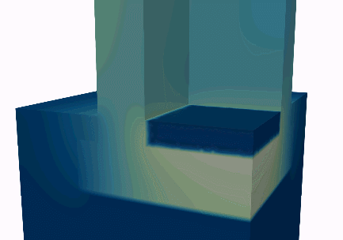

### Michele Libralato
Post-doc at [Università degli Studi di Udine (University of Udine)](http://158.110.32.35/PhD-EEES/). 

## [Blog](https://michele-libralato.github.io/blog.html)

## [Publications](https://michele-libralato.github.io/publications.html)

## [Research Group of Building Physics at the University of Udine](http://www.diegm.uniud.it/prof-saro/fisica-tecnica-ambientale/)

### github projects:

[EN ISO 13788.2013 Glaser Method implemented in Octave](https://github.com/michele-libralato/glaser_method_octave)

### PhD Thesis: 

Advanced risk assessment for mould growth conditions and interstitial condensation in building envelopes

Description: The health and safety criticalities of building enclosures are mainly related to vapour migration and heat transfer. Residential, historic and public buildings that have not been properly designed, eventualy suffer from mould or rising dump. Advanced hygrothermal simulations of building envelopes could be used for the assessment of the risk of interstitial condensation and mould growth conditions, but they are relatively recent and not well known to technicians. The aim of this research activity is to find new applications and procedures to ensure better health, safety and comfort standards for the built environment. [full-text](https://air.uniud.it/handle/11390/1185616)  Website: [PhD in Environmental and Energy Engineering Science](http://158.110.32.35/PhD-EEES/projects.html#proj5) 

